# What?

These examples use the `coffee/blam` library for opening Blam! maps. For now there are mostly Halo PC maps.

# Rendering of Blam maps

## The meltdown

Initial rendering, lots of wrong indexes everywhere. Unplayable framerates when rendering terrain.

## Getting better

Somewhat better, missing scenery, not handling multiple BSPs correctly:

## Holey moley

Loading scenery, figuring out that they use `GL_TRIANGLE_STRIP` for rendering. Notice the holes in the tree:

## Admiring the view

Loading all scenery correctly, loads an entire level with poor performance for rendering scenery, as each piece of scenery is a drawcall.

## Scenery, but faster

Rendering the entirety of 343 Guilty Spark, including scenery at nice framerates when using batching.
Also places matrices for scenery in a shader storage buffer to allow batching at all.

## Bipeds, vehicles, weapons, equipment!

More models are placed, albeit with wrong rotation in a lot of places. These all use the `mod2` format internally,
 and was very easily extended from scenery.
 
## Textures are hard

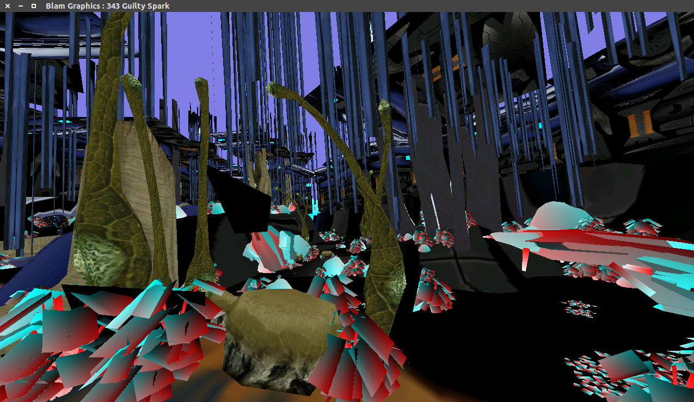
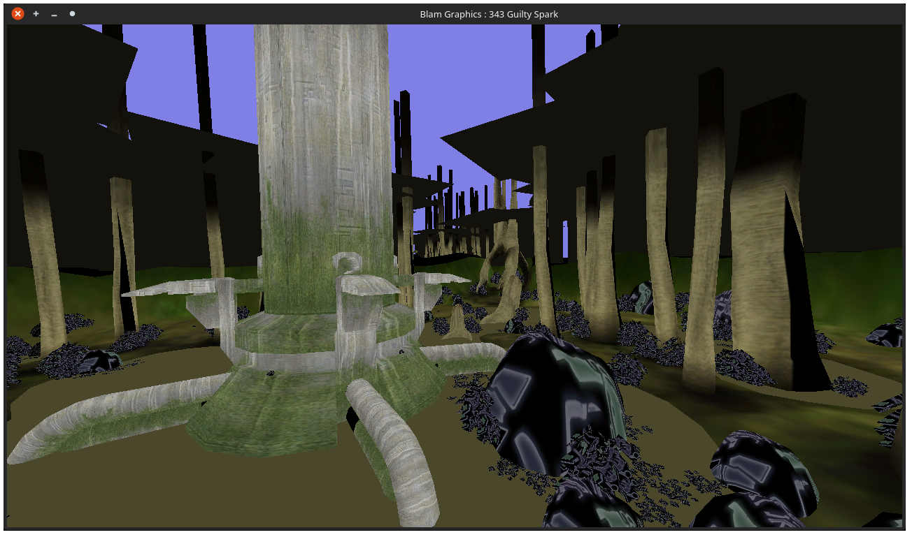

Textures are a bit of a daunting task to combine with batching. Optimally we
 want to keep the number of textures low, and minimize the waste of texture space.
This brings texture atlases to mind, as most textures have similar formats (DXTn),
 but different sizes.
The texture atlas can be trivially optimized by sorting the textures by size,
 and inserting them in order from largest to smallest.
The texture coordinates per mesh can be adjusted and wrapped afterwards.

As seen from the images, there are many issues with addressing the textures,
 some of them are correct, while others are complete garbage.

## Progress!

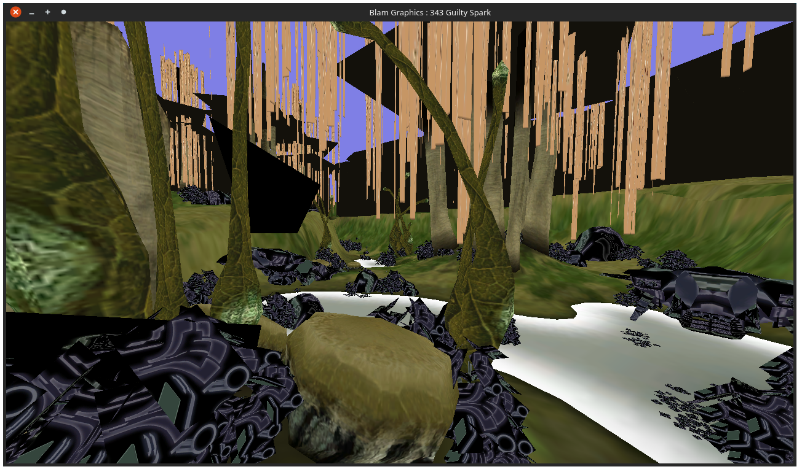

After trying many exciting ways of atlasing textures, something finally worked,
 and I called it a day. For now only the BSP shows the correct textures,
 but scenery will be there soon enough.

## Cursed models

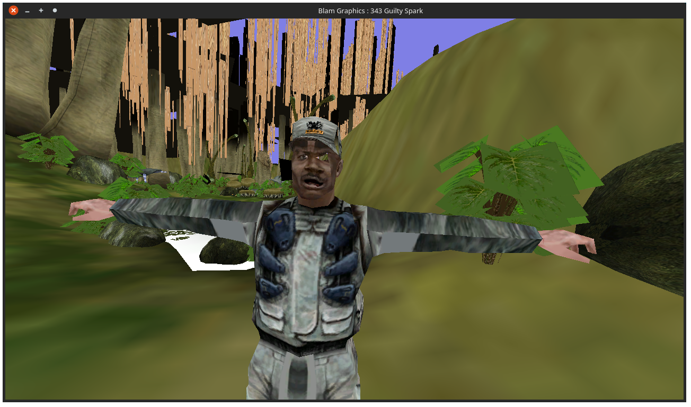

After finding out that the model instances weren't propagated to the fragment
 shader for models, they finally look better.

This image is from the start of 343 Guilty Spark, and Sgt Johnson is
 not supposed to be here. A lot of models look *almost* right, but the
 texture coordinates are somewhat off.

## Alpha to coverage is good

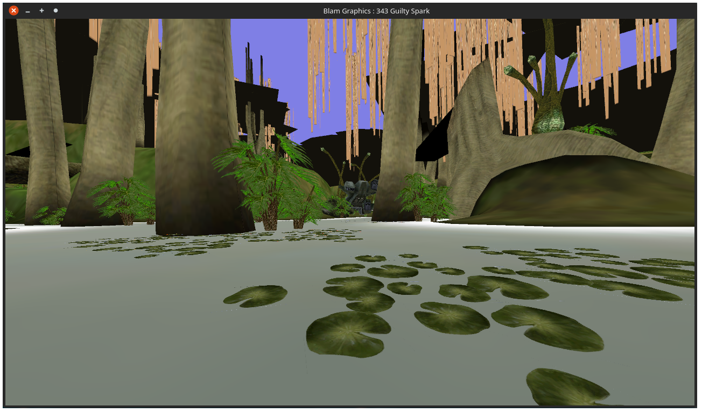
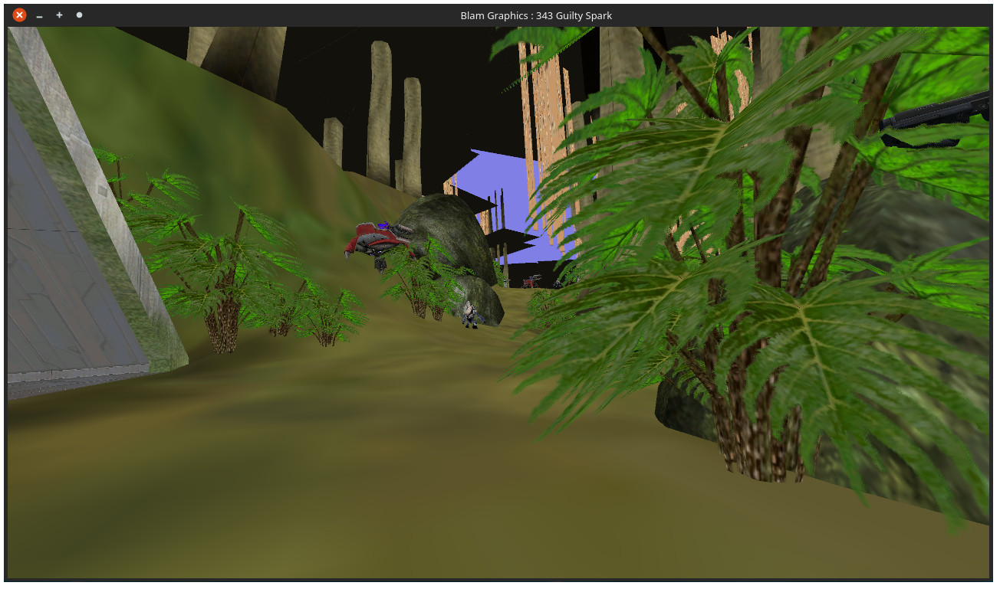
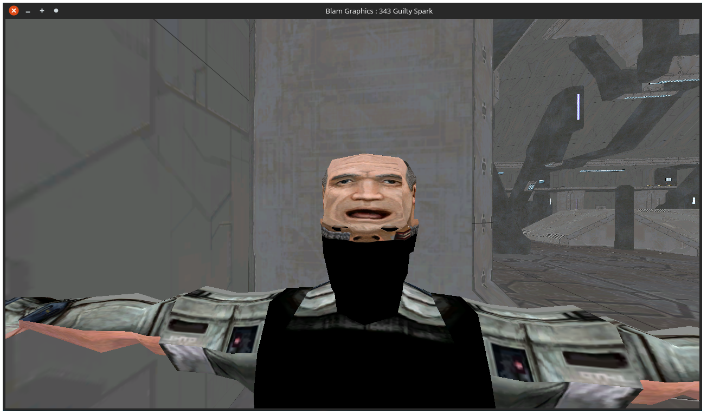

By implementing the requirements for sample alpha to coverage
 (mainly enabling multisampling), plants and other things look much better.
The people are still cursed, though.

## A rare new species

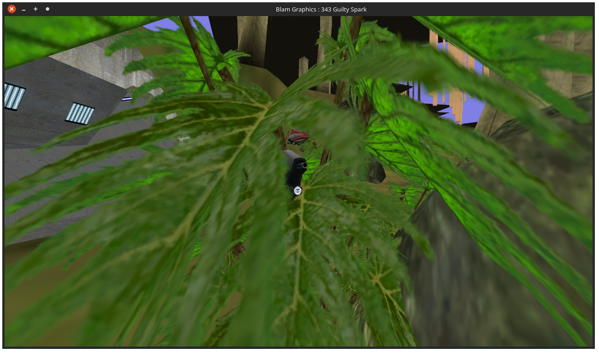

If you look closely at the above image, you may spot a rare specimen of the
 Assault Rifle species. These hide in the bushes of Guilty Spark looking for prey,
 most of which consists of grunts and jackals. They are very shy, and will
 escape from humans if given the chance. No specimen has been captured alive.

On a more serious note, I found these while wondering
"Where does the AR gunfire come from during the open parts of Guilty Spark?"
Turns out they are cinematic props that disappear when the player enters
 the area.

There are lots of scenery placed around the level, hiding behind corners and such.

## Better shaders

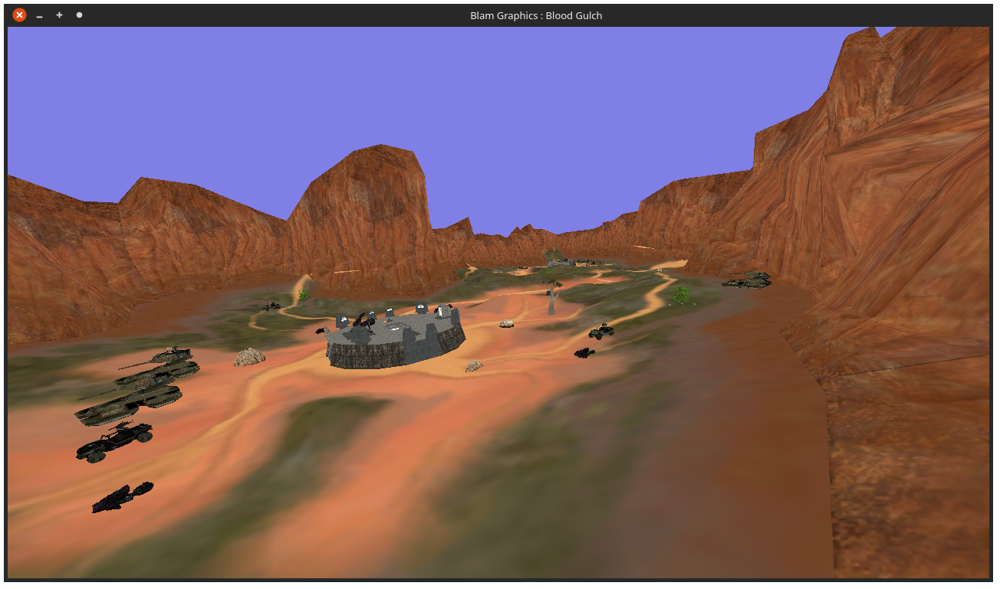
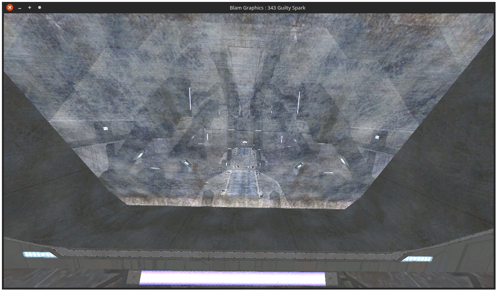

After investigating the structure of the different shaders, they are more fleshed out.
Much of the information was found from Guerilla, and winging most of the data alignment,
 since Guerilla doesn't say a thing about what types or layouts are used.
Also, Blood Gulch looks a lot better now. Models are still borked, though.

## Guns that you can see

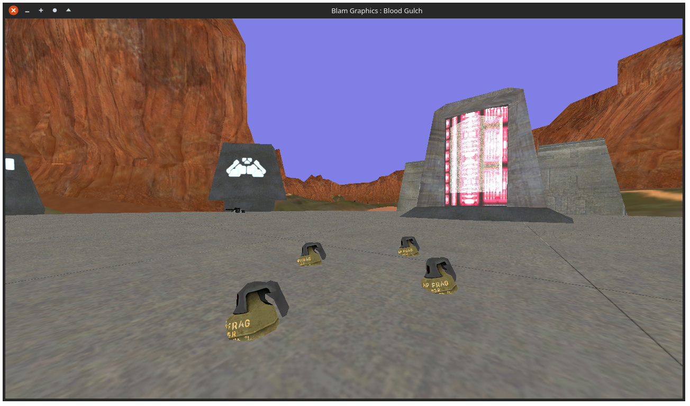
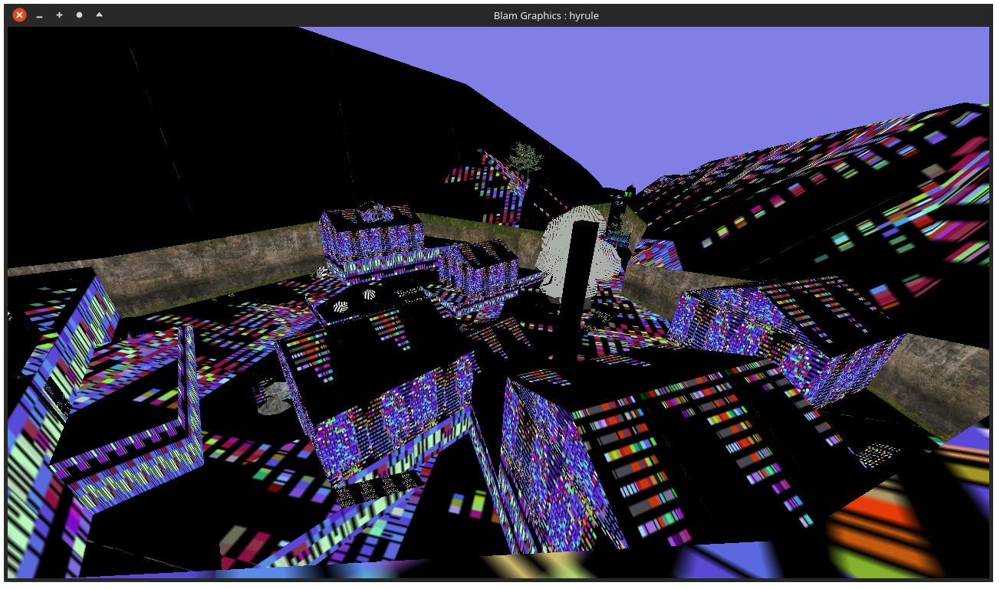

After cleaning up some code, it was more manageable to add multiplayer equipment.
Vehicles, scenery and bipeds all use the same spawning logic based on the `obje` tag,
 while multiplayer equipment uses item collections.
After working out the structure of these (mostly) and tossing out some useless code,
 they showed up nicely.

On another note, there is a bug with Custom Edition textures that needs to be figured out.

# Bytecode inspection

For now, it's possible to explore bytecode, and deduce what a script may consist of.
There are some issues currently:

 - Some opcodes are not entirely consistent across versions or maps (eg. extensions in PC compared to Xbox)
 - Some of the bytecode seems useless, eg. the segment filled with 0xCA.
 - The bytecode segment is always a fixed size of 380072 bytes, but why?

There's also a lot of data that needs to be associated with the scripting data.
Here's a dump of some bytecode from `c10`, 343 Guilty Spark, produced by BlamScripting:

    // Formatting
    #addr function_name return_type
    > opcode #addr #opcode params=# exp=#expression_type

    12 player0 unit(38)
    > opcode 6 unit(23) params=0, exp=group(8)
    26 player1 unit(38)
    > opcode 20 unit(23) params=0, exp=group(8)
    37 player_count short_(7)
    > opcode 34 list_count(46) params=0, exp=group(8)
    59 cinematic_skip_start bool_(5)
    > opcode 45 cinematic_skip_start_internal(302) params=0, exp=group(8)
    > opcode 47 game_save_totally_unsafe(318) params=0, exp=group(8)
    > opcode 49 sleep_until(20) params=5, exp=group(8)
    > opcode 56 not_(27) params=0, exp=group(8)
    68 cinematic_skip_stop void_(4)
    > opcode 67 cinematic_skip_stop_internal(303) params=0, exp=group(8)

It was discovered that Halo PC internally has 2 different bytecode versions, we'll call them `v1` and `v2`. 
`v1` is the version found in the original Xbox maps, as well as `a30` and `b30` on the PC version. Why only these
 two maps use the "older" bytecode is a bit curious.
 
As of recently more of the flow control has been implemented, such as `(if <bool> <expr>)`
 and script state changes (eg. `(wake <script>)` and `(sleep <time>)`).
Many of the state changes rely on in-game events, such as trigger volumes and cutscenes.

# Debugging help

`BlamTesting` just explores the structures, and is useful for finding new structures. It's a blob of code, no structure.

## Significant values

Values that appear time and time again as `u32`

    1065353216 = Floating-point 1.0
