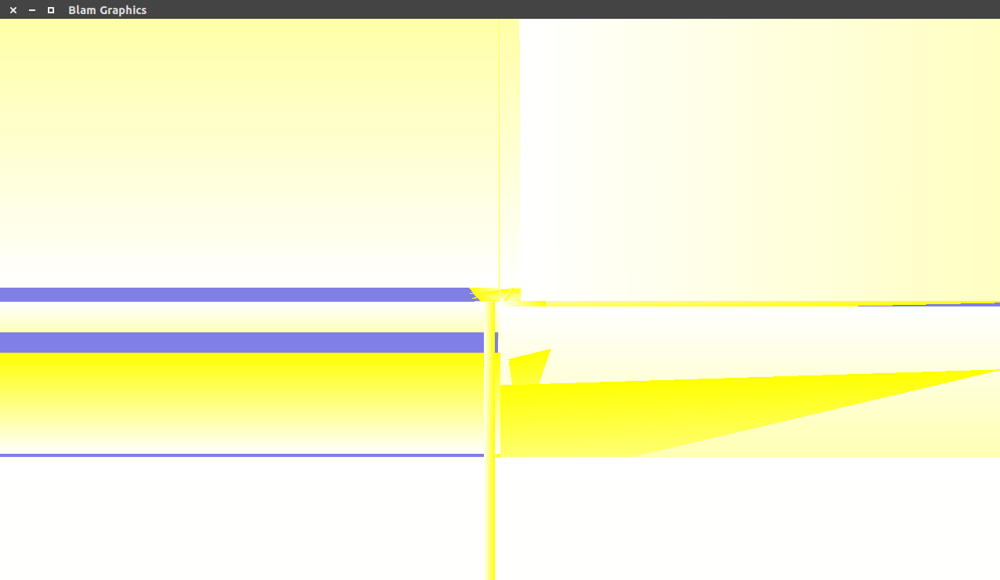
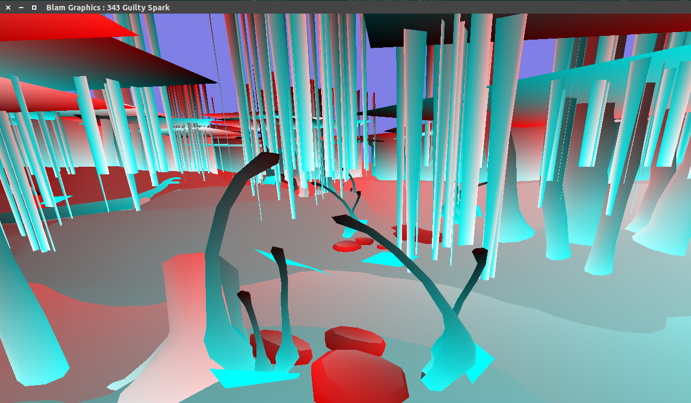
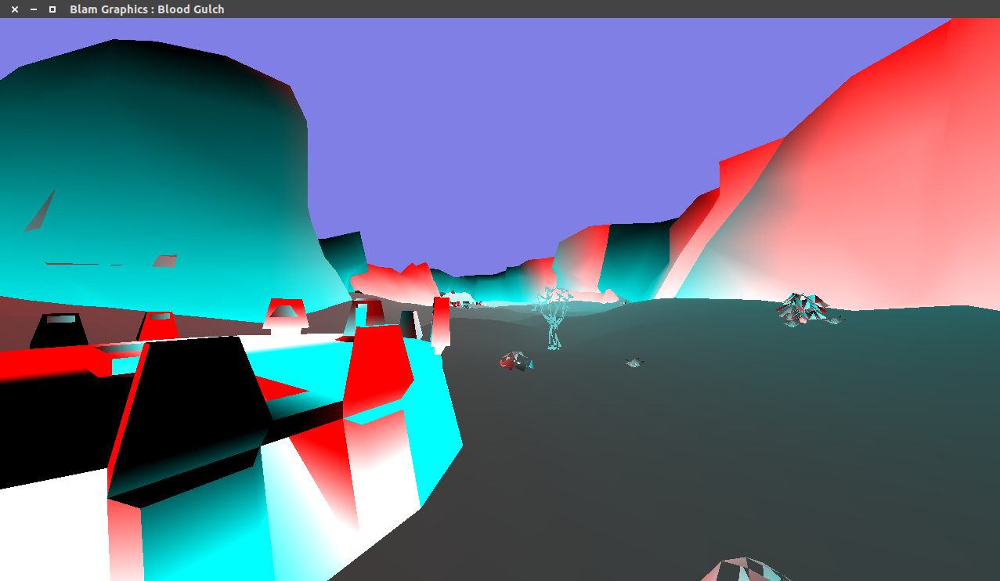
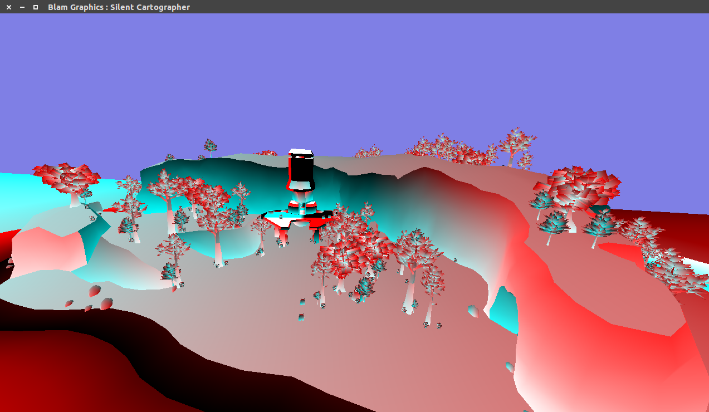
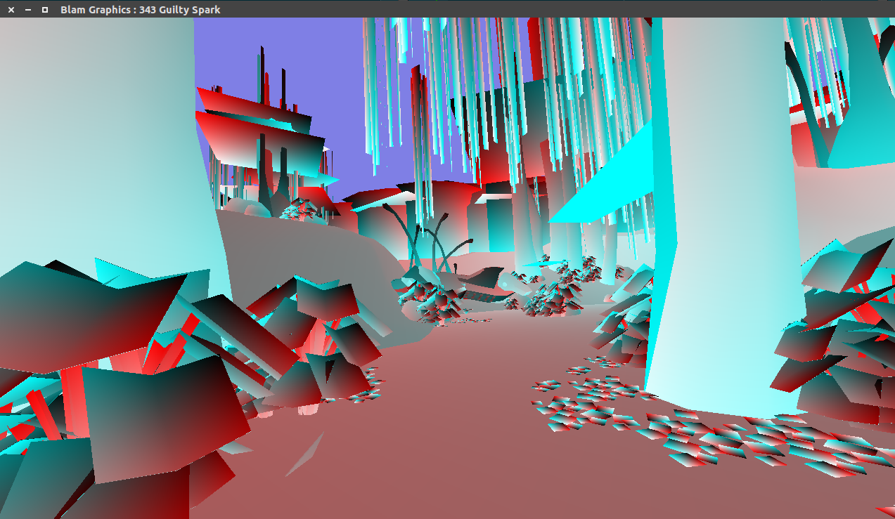
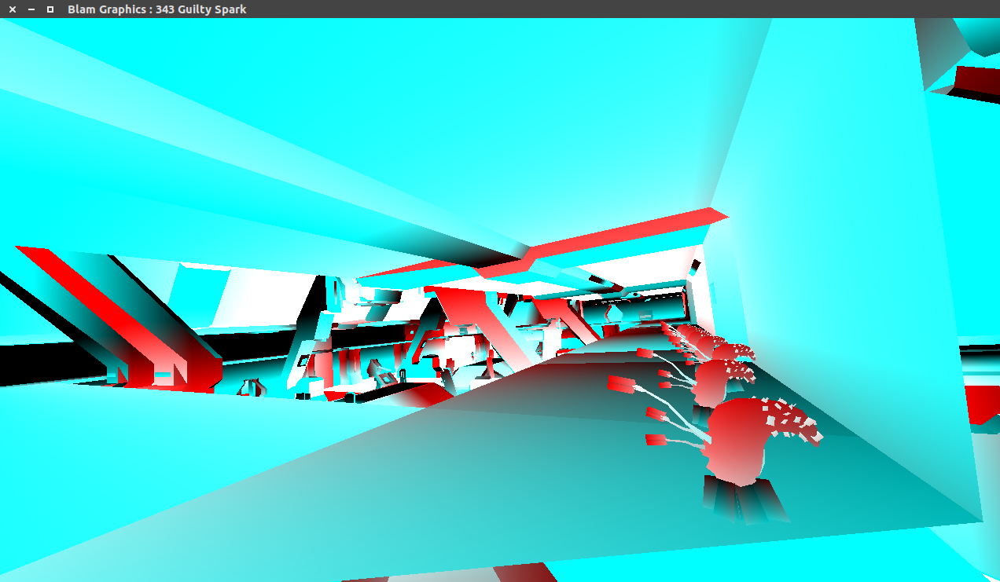
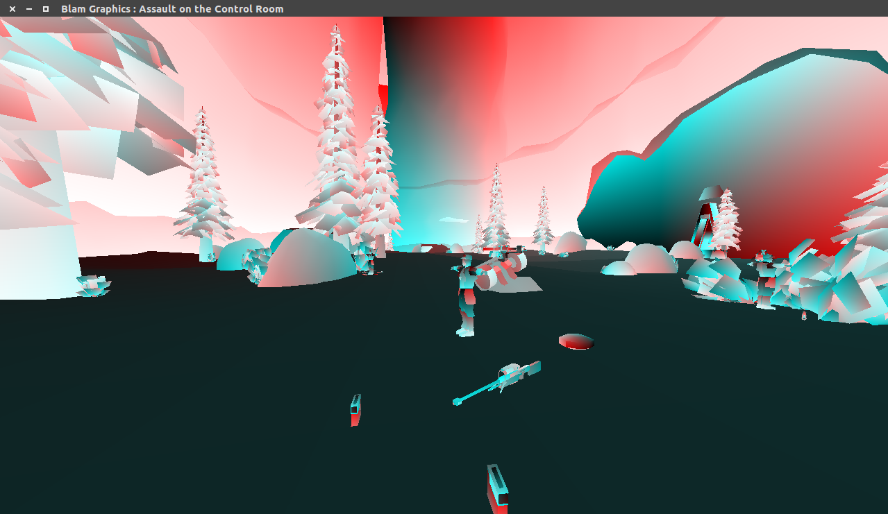
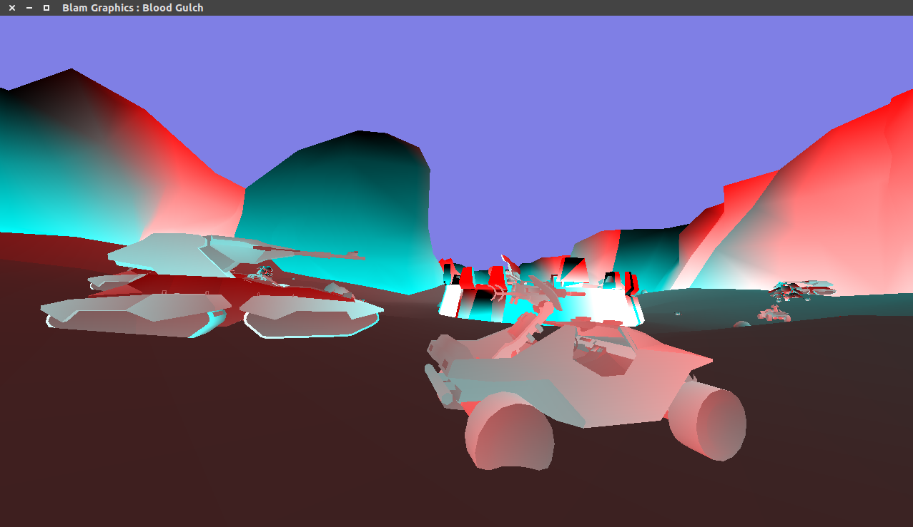

# What?

These examples use the `coffee/blam` library for opening Blam! maps. For now there are mostly Halo PC maps.

# Rendering of Blam maps

## The meltdown

Initial rendering, lots of wrong indexes everywhere. Unplayable framerates when rendering terrain.

## Getting better

Somewhat better, missing scenery, not handling multiple BSPs correctly:

## Holey moley

Loading scenery, figuring out that they use `GL_TRIANGLE_STRIP` for rendering. Notice the holes in the tree:

## Admiring the view

Loading all scenery correctly, loads an entire level with poor performance for rendering scenery, as each piece of scenery is a drawcall.

## Scenery, but faster

Rendering the entirety of 343 Guilty Spark, including scenery at nice framerates when using batching.
Also places matrices for scenery in a shader storage buffer to allow batching at all.

## Bipeds, vehicles, weapons, equipment!

# Debugging help

`BlamTesting` just explores the structures, and is useful for finding new structures. It's a blob of code, no structure.

## Significant values

Values that appear time and time again as `u32`

    1065353216 = Floating-point 1.0
